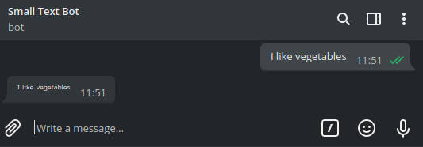

<h1 align="center">Telegram Little Letters Bot rs</h1>
<h3 align="center">More performant version of <a href="https://github.com/JonaszPotoniec/telegramSmallTextBot">telegramSmallTextBot.js</a></h3>

This is a simple telegram bot for making your message font small.  
You can test it here: <a href="https://t.me/smallText_bot">@smallText_bot</a>

---

<h3 align="center">Usage</h3>

  Just send a message to my bot and it will reply with your message but with <i>cool</i> little letters. 
Now you can forward it to your friends  

---

<h3 align="center">Statistics</h3>

  Statistics are saved in the file specified in config file in the following pattern:

<code>[ISO8601 time of interval stop] [number of messages in interval]</code>

---

<h3 align="center">Settings</h3>

<h4 align="center">Settings are stored in config.toml</h4>

| setting            | description                                                                                                       |
| ------------------ | ----------------------------------------------------------------------------------------------------------------- |
| `token`            | This is your bot token. It's required and can be easily obtained from [Bot Father](https://telegram.me/BotFather) |
| `enable_logging`   | Enable message counter                                                                                            |
| `logging_schedule` | How often statistics should be saved                                                                              |
| `logging_filename` | Statistics filename                                                                                               |
